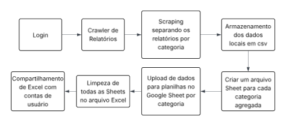

# avec_sheet

**Este repositório foi arquivado exclusivamente para fins de visualização do código. A execução da aplicação não é possível, pois as credenciais e dados sensíveis de autenticação foram removidos por motivos de segurança.**

---

## Contexto

Projeto freelancer desenvolvido no início de 2024 para um cliente que utilizava a plataforma Avec para gestão do seu negócio. A plataforma não disponibilizava API pública, o que impossibilitava a extração estruturada de dados para análise.

O projeto também marcou o início da minha atuação prática com **web scraping** e construção de **processos ETL**, aplicando esses conceitos em um cenário real de negócio, com foco em automação, organização e preparação de dados para análise.

O objetivo do sistema foi criar um pipeline automatizado para extração, transformação e organização desses dados, permitindo posterior análise por um cientista de dados.

## Problema

O cliente precisava consolidar dados operacionais da plataforma para análise estratégica, porém:

- Não havia API pública
- Não havia acesso direto ao banco da plataforma
- Não havia infraestrutura de servidor remoto para hospedagem de banco próprio

---

## Solução Implementada

Foi desenvolvido um processo de **web scraping automatizado com Selenium**, responsável por:

1. Autenticar na plataforma
2. Navegar pelas páginas relevantes
3. Extrair os dados estruturados
4. Transformar os dados em formato tabular
5. Exportar em CSV
6. Enviar para o Google Sheets para limpeza e organização final

Inicialmente, foi proposta uma arquitetura baseada em banco de dados SQL integrado ao Power BI. No entanto, a ausência de servidor remoto inviabilizou essa abordagem, levando à adoção de uma solução mais enxuta baseada em CSV + Google Sheets.

Essa decisão representa um trade-off arquitetural baseado em restrição de infraestrutura.

O módulo `db.py`, responsável pela injeção e transformação de dados para SQL, foi posteriormente descontinuado.

---

## Pipeline (Visão Simplificada)

Scraping (Selenium)  
→ Transformação de dados (Python)  
→ Geração de CSV  
→ Upload automatizado para Google Sheets  
→ Limpeza e consolidação  
→ Análise posterior  

---

## Arquivos Centrais do Projeto

- [main.py](main.py) — Orquestração do processo  
- [drive.py](modules/drive.py) — Integração com Google Drive  
- [google_sheet.py](modules/google_sheet.py) — Integração com Google Sheets  

Outros arquivos representam tentativas anteriores de arquitetura (`firebase.py`) ou módulos auxiliares para testes e manutenção (`rm_dir.py`, `erase.py`).

---

## Arquitetura e Stack

- Python 3  
- Selenium  
- Google Chrome  
- API do Google Sheets (conta de serviço)  
- Geração e manipulação de CSV  

---

## Interface Desktop (Descontinuada)

O projeto inicialmente possuía uma aplicação desktop desenvolvida em Electron JS, criada como camada de execução para o cliente final. Essa interface automatizava:

- Execução do script principal
- Instalação de dependências
- Setup do ambiente (Python, Chrome, requirements)

Foi removida do repositório por não representar o núcleo técnico do pipeline de dados.

---

## Observações Técnicas

Durante o desenvolvimento, ferramentas de Inteligência Artificial foram utilizadas como apoio, principalmente nas rotinas de transformação de tipos entre Python e SQL implementadas no módulo `db.py`.

---

## Resultado Final

O sistema gera arquivos Excel contendo múltiplas sheets agregadas e organizadas, prontos para análise.

